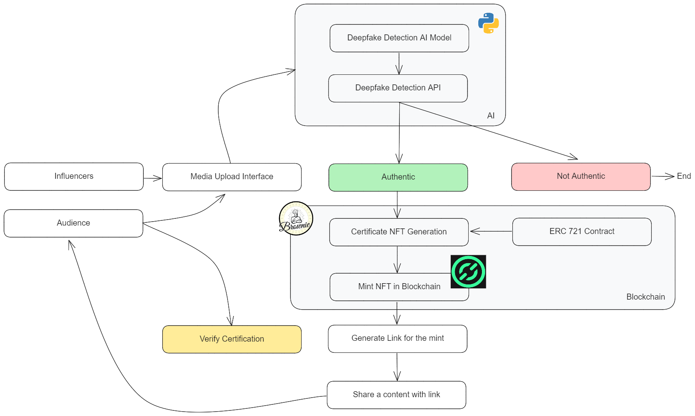
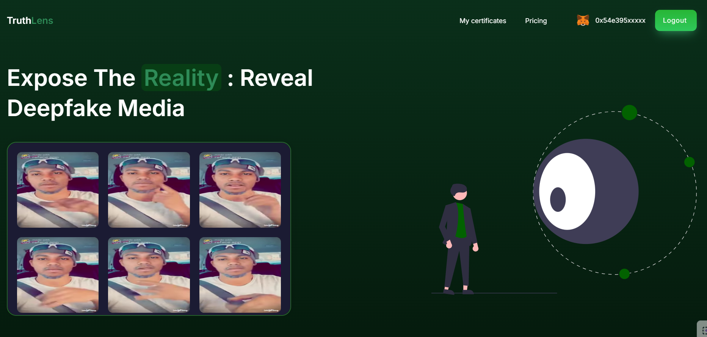
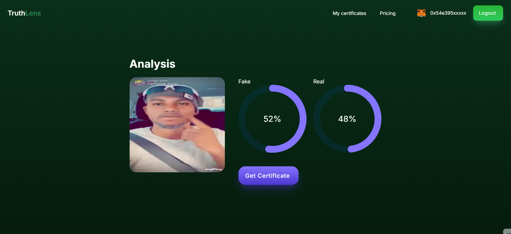
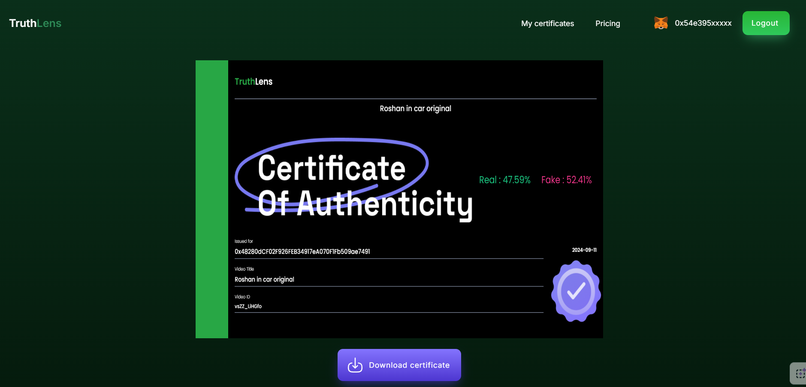
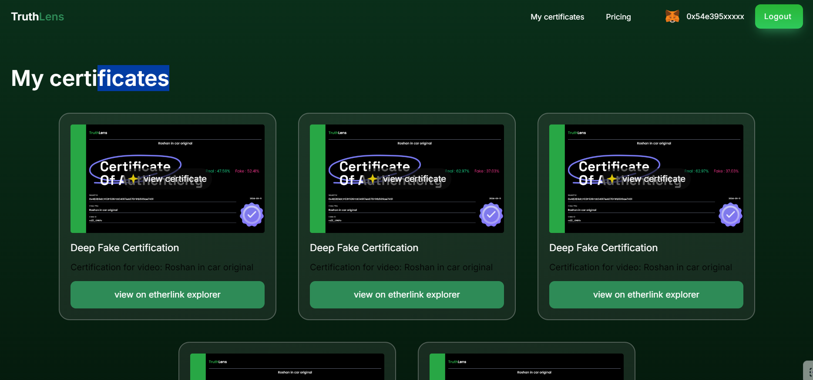

# TruthLens

**TruthLens** is a decentralized platform for media authenticity certification using blockchain. Users can analyze media files and mint NFTs as certificates on the blockchain.

## Live Demo:

**Note**: The Backend has been deployed on Docker Hub, so feel free to take a pull!

**Frontend:** https://truth-lens-seven.vercel.app/

**Backend**:  
On your C:\Users\<user>:  
`pip install brownie`  
`docker pull roshangeorge97/backend:latest`  
`docker run -p 8000:8000 roshangeorge97/backend`

**Test deepfake video**: https://www.youtube.com/shorts/vsZZ_LiHGfo

## Local Setup:

**Note**: The Backend has been deployed on Docker Hub, so feel free to take a pull!

**Frontend:** https://truth-lens-seven.vercel.app/

**Backend**:  
docker pull roshangeorge97/backend:latest 
docker run -p 8000:8000 roshangeorge97/backend                     

**Test deepfake video**: https://www.youtube.com/shorts/vsZZ_LiHGfo

## Block Explorer:

1. **Smart Contract Address**: [0xE20ea5f5a93C42E9d357aE0b6A70E0cCA0e6f88E](https://testnet.explorer.etherlink.com/address/0xE20ea5f5a93C42E9d357aE0b6A70E0cCA0e6f88E)

2. **Smart Contract Address**: [0x48280dCF02F926FEB34917eA070F1Fb509ae7491](https://testnet.explorer.etherlink.com/address/0x48280dCF02F926FEB34917eA070F1Fb509ae7491)

## Few Transactions:

1. [Transaction 1](https://testnet.explorer.etherlink.com/tx/0xbf4999bcbc96019a38bc1ff01550320f3261025477831cdda035650e0454223a)

2. [Transaction 2](https://testnet.explorer.etherlink.com/tx/0xb2f97e9b7926a52185fda4f1109342a21e37e062eb25e3f304982ac5abf9054f)

3. [Transaction 3](https://testnet.explorer.etherlink.com/tx/0xb249886cf362887598555de297b787c6ea80eba08990f31c919ecbca48d003b2)

4. [Transaction 4](https://testnet.explorer.etherlink.com/tx/0xb0ea7ee460d26a5712227e8229d5bcd6e9d61329a7fbe743d93e78fb9e6ab201)

## Tech Stack

### Frontend
- **Framework:** ReactJS

### Backend
- **Language:** Python

### Machine Learning
- **Models:**
  - VGG16
  - ResNet

### Blockchain
- **Network:** Etherlink
- **Contract Compilation & Deployment:** Brownie

## Architecture Diagram

## Screenshots

### Home Page

### File Extraction

### Data Analysis

### Certification

### List of Certifications

